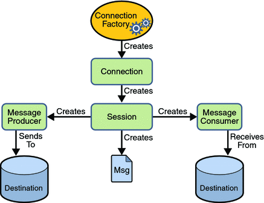

# jms-chat-app

> JMS (Java Message Service) Chat App.

## About

This repo shows a simple localhost messaging app I've made as one of my Java class assignments.

## Usage

- The admin panel acts as a program entry, logs user activity and allows them to log-in.
- Users get notified whenever someone joins or leaves, every message is timestamped.
- If a user is away, he will receive all the messages exchanged when he logs in next time [OpenJMS durable subscriber](https://openjms.sourceforge.net/usersguide/using.html) feature, see it working in the preview 

## Technology

Made with [OpenJMS](https://openjms.sourceforge.net/index.html). The Server stores a Topic, to which Message Producer / Consumers can subscribe and post messages to. It also acts as Connection Factory for its clients. 

